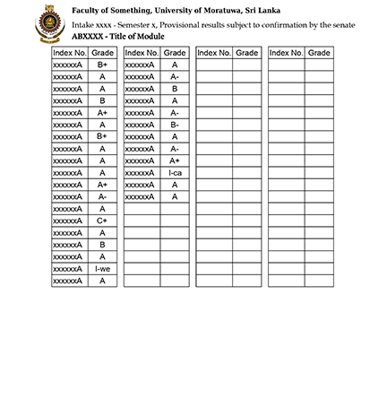

# University of Moratuwa Rank and GPA Calculator
M.S.I. Weerawansa  
In-22 BSc. Eng. (Hons.) Computer Science and Engineering  

## Description
This is a simple program that can calculate the Rank and GPA of End-Semester exams of students
studying in the University of Moratuwa, Sri Lanka.  
It makes use of the `PDFBox` library to read and extract data from Provisional Exam Results PDFs.
It can then display the results in the command line and export them into a CSV file. 

## How to use it
1. First, you choose a PDF containing the results for a module **only** your batch took.
2. You have to then specify the number of credits for that module. 
3. Then you can select the remaining results PDFs of the modules relevant to your exam which you wish to extract results from.
4. You will then be prompted to enter the number of credits for each module you have chosen.
5. The program will calculate and display the Rank and GPA of the students whose index numbers were in the PDF chosen in the first step.
6. You may then choose if you need a CSV file exported. The output will be saved to `output.csv` in the root folder.

## Method
1. The program will use the first PDF to identify the students who will be compared against each other. That is, the students appearing here will be the ones in the final ranking list. 
2. The program will store those index numbers in memory and will only consider the results of these students in the next PDFs. 
3. The number of modules each student has done will not matter. Every students' total credits done will be tracked. The final GPA will be calculated based only on that, not the total number of credits of all the modules added to the program.

### Output Format
The output format in the command line will be  
`Rank   (Position)      Index-Number        GPA     Total-Credits`  
  
Example:  
`1(  1)      200000Z         4.000       20`     
`1(  1)       200001Z         4.000       20`  
`2(  3)       200002Z         3.960       20`  
`3(  4)       200003Z         3.940       22`     

### Limitations
- This is usable **ONLY** for students in the University of Moratuwa.  
- If the format of the PDF changes, the program fails to work.
- The module code format must stay consistent for the program to work. 
- It cannot accurately calculate GPA of students who have had medical leave for some modules.

### Grade and Grade Point
| **Grade** | **Grade Point** |
|-----------|--------------------|
| A+        | 4.0                |
| A         | 4.0                |
| A-        | 3.7                |
| B+        | 3.3                |
| B         | 3.0                |
| B-        | 2.7                |
| C+        | 2.3                |
| C         | 2.0                |
| C-        | 1.7                |
| D         | 1.0                |
| I-we      | 0.0                |
| I-ca      | 0.0                |
| F         | 0.0                |

### Compatible PDF Format
